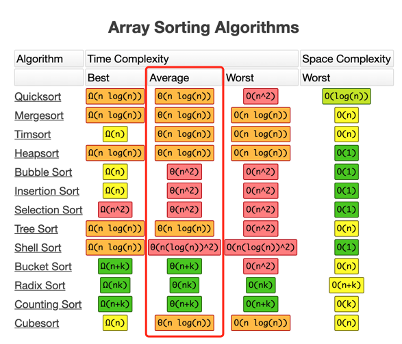

# 1. 排序算法

[1.1 归并排序(Merge_Sort)](https://alter1125.github.io/cn/%E6%8E%92%E5%BA%8F%E7%AE%97%E6%B3%95(%E4%B8%80)%E4%B9%8B%E5%BD%92%E5%B9%B6%E6%8E%92%E5%BA%8F/)
[1.2 拓扑排序(Topological_Sort)](https://alter1125.github.io/cn/%E6%8E%92%E5%BA%8F%E7%AE%97%E6%B3%95(%E4%BA%8C)%E4%B9%8B%E6%8B%93%E6%89%91%E6%8E%92%E5%BA%8F/)

# 2. 查找算法
[2.1 二分查找(Binary_Search)](https://alter1125.github.io/cn/%E6%9F%A5%E6%89%BE%E7%AE%97%E6%B3%95(%E4%B8%80)%E4%B9%8B%E4%BA%8C%E5%88%86%E6%9F%A5%E6%89%BE/)

[动画图解](https://visualgo.net/en)